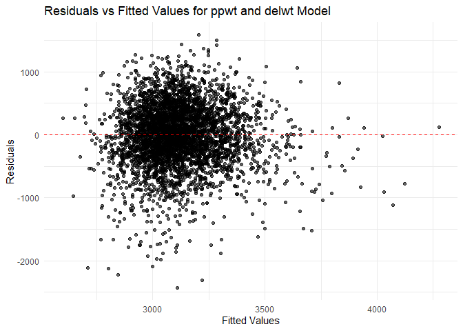

Homework 6
================
Xiaoni Xu
2024-11-25

``` r
library(tidyverse)
library(ggplot2)
library(dplyr)
library(modelr)
library(purrr)
library(tidyr)
library(forcats)

set.seed(1)
```

## Problem 1

Loading the weather data.

``` r
weather_df = 
  rnoaa::meteo_pull_monitors(
    c("USW00094728"),
    var = c("PRCP", "TMIN", "TMAX"), 
    date_min = "2017-01-01",
    date_max = "2017-12-31") %>%
  mutate(
    name = recode(id, USW00094728 = "CentralPark_NY"),
    tmin = tmin / 10,
    tmax = tmax / 10) %>%
  select(name, id, everything())
```

    ## using cached file: C:\Users\berns\AppData\Local/R/cache/R/rnoaa/noaa_ghcnd/USW00094728.dly

    ## date created (size, mb): 2024-09-26 10:20:22.546961 (8.668)

    ## file min/max dates: 1869-01-01 / 2024-09-30

Use 5000 bootstrap samples and, for each bootstrap sample, produce
estimates of these two quantities, $\hat{R}^2$ and
$\log(\hat{\beta}_0 \hat{\beta}_1)$

``` r
# Bootstrap function using broom:: functions
bootstrap_regression <- function(data, n_bootstrap = 5000) {
  n <- nrow(data)
  
  # Initialize vectors to store results
  r_squared <- numeric(n_bootstrap)
  log_beta_product <- numeric(n_bootstrap)
  
  for (i in 1:n_bootstrap) {
    bootstrap_sample <- data[sample(1:n, n, replace = TRUE), ]
    
    lm_fit <- lm(tmax ~ tmin, data = bootstrap_sample)
    
    r_squared[i] <- broom::glance(lm_fit)$r.squared
    
    # Extract coefficients using broom::tidy() and compute log(beta_0 * beta_1)
    coef_values <- broom::tidy(lm_fit) %>%
      filter(term %in% c("(Intercept)", "tmin")) %>%
      pull(estimate)
    
    beta_0 <- coef_values[1]
    beta_1 <- coef_values[2]
    log_beta_product[i] <- log(abs(beta_0 * beta_1)) # Use abs() to avoid log of negatives
  }
  
  # Return a data frame with the results
  tibble(
    r_squared = r_squared,
    log_beta_product = log_beta_product
  )
}

bootstrap_results <- bootstrap_regression(weather_df)

summary(bootstrap_results)
```

    ##    r_squared      log_beta_product
    ##  Min.   :0.8739   Min.   :1.922   
    ##  1st Qu.:0.9057   1st Qu.:1.997   
    ##  Median :0.9118   Median :2.013   
    ##  Mean   :0.9113   Mean   :2.013   
    ##  3rd Qu.:0.9171   3rd Qu.:2.030   
    ##  Max.   :0.9373   Max.   :2.102

Plot the distribution of your estimates, and describe these in words.

``` r
# Visualize the distribution of R-hat squared
ggplot(bootstrap_results, aes(x = r_squared)) +
  geom_histogram(bins = 30, fill = "#007bbb", alpha = 0.7) +
  labs(
    title = "Distribution of R-hat Squared (\u005cR^2)",
    x = expression(hat(R)^2),
    y = "Frequency"
  ) +
  theme_minimal()
```

<!-- -->

``` r
# Visualize the distribution of log(beta_0 * beta_1)
ggplot(bootstrap_results, aes(x = log_beta_product)) +
  geom_histogram(bins = 30, fill = "#79ba00", alpha = 0.7) +
  labs(
    title = "Distribution of log(beta_0 hat * beta_1 hat)",
    x = expression(log(hat(beta)[0] * hat(beta)[1])),
    y = "Frequency"
  ) +
  theme_minimal()
```

<!-- -->

The distribution of $\hat{R}^2$ is unimodal and follows an approximate
normal distribution, with most values clustering around the average
$R^2$ = 0.9114 of the linear regression model.

The distribution of $\log(\hat{\beta}_0 \hat{\beta}_1)$ is unimodal and
follows an approximate normal distribution, with most values clustering
around the average $\log(\hat{\beta}_0 \hat{\beta}_1)$ = 2.013 of the
linear regression model.

Using the 5000 bootstrap estimates, identify the 2.5% and 97.5%
quantiles to provide a 95% confidence interval for both quantities.

``` r
ci_r_squared <- quantile(bootstrap_results$r_squared, c(0.025, 0.975))
ci_log_beta_product <- quantile(bootstrap_results$log_beta_product, c(0.025, 0.975))

list(
  r_squared_ci = ci_r_squared,
  log_beta_product_ci = ci_log_beta_product
)
```

    ## $r_squared_ci
    ##      2.5%     97.5% 
    ## 0.8936684 0.9271060 
    ## 
    ## $log_beta_product_ci
    ##     2.5%    97.5% 
    ## 1.964949 2.058887

## Problem 2

Loading the homicide data

``` r
hmc <- read_csv("data/homicide-data.csv")
```

    ## Rows: 52179 Columns: 12
    ## ── Column specification ────────────────────────────────────────────────────────
    ## Delimiter: ","
    ## chr (9): uid, victim_last, victim_first, victim_race, victim_age, victim_sex...
    ## dbl (3): reported_date, lat, lon
    ## 
    ## ℹ Use `spec()` to retrieve the full column specification for this data.
    ## ℹ Specify the column types or set `show_col_types = FALSE` to quiet this message.

Create a `city_state` variable, and a binary variable indicating whether
the homicide is solved. Limit our analysis only for whom `victim_race`
is `white` or `black`. Ensure that `victim_age` is numeric.

``` r
hmc_cleaned <- hmc %>%
  # Create `city_state` variable
  mutate(city_state = paste(city, state, sep = ", "),
         # Create binary `solved` variable (1 if solved, 0 if not)
         solved = if_else(grepl("Closed", disposition), 1, 0)) %>%
  # Omit cities as specified
  filter(
    !(city_state %in% c("Dallas, TX", "Phoenix, AZ", "Kansas City, MO", "Tulsa, AL"))
  ) %>%
  # Filter for `victim_race` as "White" or "Black"
  filter(victim_race %in% c("White", "Black")) %>%
  # Remove rows with `victim_age` as "Unknown"
  filter(victim_age != "Unknown") %>%
  # Ensure `victim_age` is numeric
  mutate(victim_age = as.numeric(victim_age))
```

For the city of Baltimore, MD, use the `glm` function to fit a logistic
regression with resolved vs unresolved as the outcome and victim age,
sex and race as predictors. Obtain the estimate and confidence interval
of the adjusted odds ratio for solving homicides comparing male victims
to female victims keeping all other variables fixed.

``` r
# Load and preprocess the Baltimore data
baltimore_df <- read_csv("data/homicide-data.csv") |> 
  filter(city == "Baltimore") |> 
  mutate(
    resolved = as.numeric(disposition == "Closed by arrest"), 
    victim_age = as.numeric(victim_age),                     
    victim_race = fct_relevel(victim_race, "White")         
  ) |> 
  select(resolved, victim_age, victim_race, victim_sex)
```

    ## Rows: 52179 Columns: 12
    ## ── Column specification ────────────────────────────────────────────────────────
    ## Delimiter: ","
    ## chr (9): uid, victim_last, victim_first, victim_race, victim_age, victim_sex...
    ## dbl (3): reported_date, lat, lon
    ## 
    ## ℹ Use `spec()` to retrieve the full column specification for this data.
    ## ℹ Specify the column types or set `show_col_types = FALSE` to quiet this message.

``` r
# Fit the logistic regression model
fit_logistic <- baltimore_df |> 
  glm(resolved ~ victim_age + victim_race + victim_sex, data = _, family = binomial())
# Save the output of `glm` as an R object

# Tidy the model output and compute adjusted odds ratios (ORs)
tidy_results <- fit_logistic |> 
  broom::tidy(conf.int = TRUE, exponentiate = TRUE) |> # apply the `broom::tidy` to this object
  select(term, log_OR = estimate, OR = estimate, conf.low, conf.high, p.value) |> 
  knitr::kable(digits = 3)

# Display the tidy table
tidy_results
```

| term                | log_OR |    OR | conf.low | conf.high | p.value |
|:--------------------|-------:|------:|---------:|----------:|--------:|
| (Intercept)         |  3.287 | 3.287 |    2.083 |     5.236 |   0.000 |
| victim_age          |  0.993 | 0.993 |    0.986 |     0.999 |   0.027 |
| victim_raceAsian    |  1.345 | 1.345 |    0.379 |     5.415 |   0.653 |
| victim_raceBlack    |  0.431 | 0.431 |    0.305 |     0.606 |   0.000 |
| victim_raceHispanic |  0.767 | 0.767 |    0.411 |     1.426 |   0.402 |
| victim_raceOther    |  0.464 | 0.464 |    0.063 |     2.460 |   0.385 |
| victim_sexMale      |  0.415 | 0.415 |    0.317 |     0.542 |   0.000 |

- The adjusted odds ratio for `victim_sexMale` is 0.415, indicating that
  homicides involving male victims are significantly less likely to be
  resolved compared to female victims.

- The adjusted odds ratio for `victim_raceBlack` is 0.431, indicating
  that homicides involving Black victims are significantly less likely
  to be resolved compared to victims of other races.

- The adjusted odds ratio for `victim_age` is 0.993, indicating that age
  does not have a statistically significant effect on the likelihood of
  resolving homicide cases.

Obtaining the estimate and confidence interval of the adjusted odds
ratio for solving homicides comparing male victims to female victims
keeping all other variables fixed.

``` r
# Fit logistic regression model
fit_logistic <- glm(resolved ~ victim_age + victim_race + victim_sex, 
                    data = baltimore_df, family = binomial())

# Use broom::tidy to summarize the model and compute odds ratios
tidy_results <- broom::tidy(fit_logistic, conf.int = TRUE, exponentiate = TRUE)

# Extract the results for "victim_sexMale"
tidy_results |> 
  filter(term == "victim_sexMale") |> 
  select(term, estimate = estimate, conf.low, conf.high, p.value)
```

    ## # A tibble: 1 × 5
    ##   term           estimate conf.low conf.high  p.value
    ##   <chr>             <dbl>    <dbl>     <dbl>    <dbl>
    ## 1 victim_sexMale    0.415    0.317     0.542 1.15e-10

Run `glm` for each of the cities in the dataset, and extract the
adjusted odds ratio (and CI) for solving homicides comparing male
victims to female victims.

``` r
# Logistic regression by city using hmc_cleaned
city_results <- hmc_cleaned %>%
  group_by(city_state) %>% # Group by city_state
  nest() %>%              # Nest data for each city_state
  mutate(
    # fit logistic regression for each city
    model = purrr::map(data, ~ glm(solved ~ victim_age + victim_race + victim_sex, 
                                   data = ., family = binomial())),
    tidy_results = purrr::map(model, ~ broom::tidy(.x, conf.int = TRUE, exponentiate = TRUE))
  ) %>%
  tidyr::unnest(tidy_results) %>% 
  # compare male to female victims
  filter(term == "victim_sexMale") %>%
  select(city_state, estimate, conf.low, conf.high, p.value) # Select relevant columns
```

    ## Warning: There were 44 warnings in `mutate()`.
    ## The first warning was:
    ## ℹ In argument: `tidy_results = purrr::map(model, ~broom::tidy(.x, conf.int =
    ##   TRUE, exponentiate = TRUE))`.
    ## ℹ In group 1: `city_state = "Albuquerque, NM"`.
    ## Caused by warning:
    ## ! glm.fit: fitted probabilities numerically 0 or 1 occurred
    ## ℹ Run `dplyr::last_dplyr_warnings()` to see the 43 remaining warnings.

``` r
# View the results
city_results
```

    ## # A tibble: 47 × 5
    ## # Groups:   city_state [47]
    ##    city_state      estimate conf.low conf.high  p.value
    ##    <chr>              <dbl>    <dbl>     <dbl>    <dbl>
    ##  1 Albuquerque, NM    0.430   0.132      1.16  1.22e- 1
    ##  2 Atlanta, GA        0.512   0.323      0.789 3.22e- 3
    ##  3 Baltimore, MD      0.355   0.267      0.468 3.74e-13
    ##  4 Baton Rouge, LA    0.319   0.160      0.596 5.87e- 4
    ##  5 Birmingham, AL     0.704   0.444      1.09  1.25e- 1
    ##  6 Boston, MA         0.674   0.353      1.28  2.26e- 1
    ##  7 Buffalo, NY        0.438   0.239      0.793 6.78e- 3
    ##  8 Charlotte, NC      0.301   0.143      0.572 6.16e- 4
    ##  9 Chicago, IL        0.391   0.321      0.476 9.40e-21
    ## 10 Cincinnati, OH     0.206   0.0977     0.390 5.98e- 6
    ## # ℹ 37 more rows

Create a plot that shows the estimated ORs and CIs for each city.

``` r
ggplot(city_results, aes(x = reorder(city_state, estimate), y = estimate)) +
  geom_errorbar(aes(ymin = conf.low, ymax = conf.high), width = 0.6, size = 0.7, color = "#95adba") + 
  geom_point(size = 2.5, color = "#007bbb") + 
  coord_flip() +
  labs(
    title = "Adjusted Odds Ratios for Solving Homicides by City",
    x = "City",
    y = "Adjusted Odds Ratio (Male vs Female)"
  ) +
  theme_minimal()
```

    ## Warning: Using `size` aesthetic for lines was deprecated in ggplot2 3.4.0.
    ## ℹ Please use `linewidth` instead.
    ## This warning is displayed once every 8 hours.
    ## Call `lifecycle::last_lifecycle_warnings()` to see where this warning was
    ## generated.

<!-- -->

Comments:

- Most cities have an OR below 1, indicating that homicides involving
  male victims are generally less likely to be solved compared to female
  victims.

- Some cities, such as New York, NY (OR = 0.161) and Cincinnati, OH (OR
  = 0.206), show very low ORs, showing a strong disparity in case
  resolution rates.

- Cities such as Fresno, CA (OR = 1.129) and Minneapolis, MN (OR =
  1.075) have ORs above 1, implying that male victim cases are slightly
  more likely to be resolved in these cities.

- Cities like New York, NY and Philadelphia, PA have narrow confidence
  intervals, showing that the estimates are more reliable or the data
  sizes are bigger.

- Cities such as Stockton, CA (p = 0.89) and Minneapolis, MN (p = 0.84)
  have very high p-values (\> 0.05), indicating that the observed
  differences are not statistically meaningful.

## Problem 3

Loading birthweight data; clean the data for regression analysis
(i.e. convert numeric to factor where appropriate, check for missing
data, etc.).

``` r
bwt <- read_csv("data/birthweight.csv")
```

    ## Rows: 4342 Columns: 20
    ## ── Column specification ────────────────────────────────────────────────────────
    ## Delimiter: ","
    ## dbl (20): babysex, bhead, blength, bwt, delwt, fincome, frace, gaweeks, malf...
    ## 
    ## ℹ Use `spec()` to retrieve the full column specification for this data.
    ## ℹ Specify the column types or set `show_col_types = FALSE` to quiet this message.

``` r
bwt_cleaned <- bwt %>%
  # Convert variables to factors where appropriate
  mutate(
    babysex = factor(babysex, levels = c(1, 2), labels = c("Male", "Female")),
    frace = factor(frace, levels = c(1, 2, 3, 4, 8, 9), labels = c("White", "Black", "Asian", "Puerto Rican", "Other", "Unknown")),
    mrace = factor(mrace, levels = c(1, 2, 3, 4, 8), labels = c("White", "Black", "Asian", "Puerto Rican", "Other")),
    malform = factor(malform, levels = c(0, 1), labels = c("Absent", "Present")),
    parity = factor(parity), 
    pnumlbw = as.numeric(pnumlbw), 
    pnumsga = as.numeric(pnumsga),  
    smoken = as.numeric(smoken)  
  ) %>%
  filter(
    !is.na(bwt),                  
    !frace %in% "Unknown"         # Remove rows with father's race "Unknown"
  ) %>%
  # Select relevant columns and ensure continuous variables are in proper format
  mutate(
    bhead = as.numeric(bhead),     # Ensure numeric for baby's head circumference
    blength = as.numeric(blength), # Ensure numeric for baby's length
    bwt = as.numeric(bwt),         # Ensure numeric for baby's weight
    delwt = as.numeric(delwt),     # Ensure numeric for mother's delivery weight
    fincome = as.numeric(fincome), # Ensure numeric for family income
    gaweeks = as.numeric(gaweeks), # Ensure numeric for gestational weeks
    menarche = as.numeric(menarche), # Ensure numeric for mother's age at menarche
    mheight = as.numeric(mheight),   # Ensure numeric for mother's height
    momage = as.numeric(momage),     # Ensure numeric for mother's age
    ppbmi = as.numeric(ppbmi),       # Ensure numeric for pre-pregnancy BMI
    ppwt = as.numeric(ppwt),         # Ensure numeric for pre-pregnancy weight
    wtgain = as.numeric(wtgain)      # Ensure numeric for weight gain
  ) 
```

Propose a regression model for birthweight. This model may be based on a
hypothesized structure for the factors that underly birthweight, on a
data-driven model-building process, or a combination of the two.

``` r
# Fit the regression model with ppwt and delwt
ppwt_delwt_model <- lm(bwt ~ ppwt + delwt, data = bwt_cleaned)

# Summarize the model
summary(ppwt_delwt_model)
```

    ## 
    ## Call:
    ## lm(formula = bwt ~ ppwt + delwt, data = bwt_cleaned)
    ## 
    ## Residuals:
    ##      Min       1Q   Median       3Q      Max 
    ## -2428.89  -282.42    19.08   311.29  1585.38 
    ## 
    ## Coefficients:
    ##              Estimate Std. Error t value Pr(>|t|)    
    ## (Intercept) 2207.7984    49.2541  44.825   <2e-16 ***
    ## ppwt          -7.1351     0.7437  -9.595   <2e-16 ***
    ## delwt         12.2807     0.6751  18.190   <2e-16 ***
    ## ---
    ## Signif. codes:  0 '***' 0.001 '**' 0.01 '*' 0.05 '.' 0.1 ' ' 1
    ## 
    ## Residual standard error: 485.5 on 4339 degrees of freedom
    ## Multiple R-squared:  0.1019, Adjusted R-squared:  0.1015 
    ## F-statistic: 246.2 on 2 and 4339 DF,  p-value: < 2.2e-16

Describe your modeling process and show a plot of model residuals
against fitted values – use add_predictions and add_residuals in making
this plot.

``` r
bwt_with_residuals <- bwt_cleaned %>%
  add_predictions(ppwt_delwt_model, var = "fitted") %>% # Add fitted values
  add_residuals(ppwt_delwt_model, var = "residuals")   # Add residuals

# Plot residuals against fitted values
ggplot(bwt_with_residuals, aes(x = fitted, y = residuals)) +
  geom_point(alpha = 0.6) + # Scatter plot of residuals
  geom_hline(yintercept = 0, linetype = "dashed", color = "red") + 
  labs(
    title = "Residuals vs Fitted Values for ppwt and delwt Model",
    x = "Fitted Values",
    y = "Residuals"
  ) +
  theme_minimal()
```

<!-- -->

The predictors include maternal characteristics of the following:

- Pre-pregnancy weight (`ppwt`)

- Mother’s weight at delivery (`delwt`)

I am curious about the relationship between weight of the mother and the
birthweight of the baby, so only weight-related variables `ppwt` and
`delwt` are chosen for the linear regression model.

Comparing my model to two others:

- One using length at birth and gestational age as predictors (main
  effects only);

- One using head circumference, length, sex, and all interactions
  (including the three-way interaction) between these.

Make this comparison in terms of the cross-validated prediction error.

Define the models

``` r
model_ppwt_delwt <- lm(bwt ~ ppwt + delwt, data = bwt_cleaned)

model_blength_gaweeks <- lm(bwt ~ blength + gaweeks, data = bwt_cleaned)

model_full_interaction <- lm(bwt ~ bhead * blength * babysex, data = bwt_cleaned)
```

Visualize the goodness of fit for the three models using
`gather_predictions`

``` r
# Combine predictions for all three models
bwt_cleaned_with_predictions <- bwt_cleaned %>%
  gather_predictions(model_ppwt_delwt, model_blength_gaweeks, model_full_interaction) %>%
  mutate(model = fct_inorder(model)) # Ensure correct order of models

# Plot goodness of fit
ggplot(bwt_cleaned_with_predictions, aes(x = ppwt, y = bwt)) + # Adjust x-axis depending on model
  geom_point(alpha = 0.5) + # Observed data points
  geom_line(aes(y = pred), color = "#007bbb") + # Predicted values
  facet_grid(~model) + # Separate by model
  labs(
    title = "Goodness of Fit for Birthweight Models",
    x = "Predictor (depends on model)",
    y = "Birthweight"
  ) +
  theme_minimal()
```

<!-- -->

Perform cross-validation and calculate RMSEs

``` r
# Perform Monte Carlo cross-validation
cv_df <- crossv_mc(bwt_cleaned, 100) %>%
  mutate(
    train = map(train, as_tibble),
    test = map(test, as_tibble)
  )

# Fit models on training data and calculate RMSEs for testing data
cv_df <- cv_df %>%
  mutate(
    ppwt_delwt_mod = map(train, \(df) lm(bwt ~ ppwt + delwt, data = df)),
    blength_gaweeks_mod = map(train, \(df) lm(bwt ~ blength + gaweeks, data = df)),
    full_interaction_mod = map(train, \(df) lm(bwt ~ bhead * blength * babysex, data = df))
  ) %>%
  mutate(
    rmse_ppwt_delwt = map2_dbl(ppwt_delwt_mod, test, \(mod, df) {
      predictions <- predict(mod, newdata = df)
      sqrt(mean((df$bwt - predictions)^2))
    }),
    rmse_blength_gaweeks = map2_dbl(blength_gaweeks_mod, test, \(mod, df) {
      predictions <- predict(mod, newdata = df)
      sqrt(mean((df$bwt - predictions)^2))
    }),
    rmse_full_interaction = map2_dbl(full_interaction_mod, test, \(mod, df) {
      predictions <- predict(mod, newdata = df)
      sqrt(mean((df$bwt - predictions)^2))
    })
  )

# Summarize average RMSE for each model
cv_summary <- cv_df %>%
  summarize(
    mean_rmse_ppwt_delwt = mean(rmse_ppwt_delwt),
    mean_rmse_blength_gaweeks = mean(rmse_blength_gaweeks),
    mean_rmse_full_interaction = mean(rmse_full_interaction)
  )

cv_summary
```

    ## # A tibble: 1 × 3
    ##   mean_rmse_ppwt_delwt mean_rmse_blength_gaweeks mean_rmse_full_interaction
    ##                  <dbl>                     <dbl>                      <dbl>
    ## 1                 485.                      335.                       290.

Plot prediction error distribution

``` r
# Reshape RMSE results into long format
rmse_distribution <- cv_df %>%
  select(starts_with("rmse")) %>%
  pivot_longer(
    everything(),
    names_to = "model", 
    values_to = "rmse",
    names_prefix = "rmse_"
  ) %>%
  mutate(model = fct_inorder(model)) # Ensure correct order of models

# Plot RMSE distribution
ggplot(rmse_distribution, aes(x = model, y = rmse)) +
  geom_violin(fill = "#007bbb", alpha = 0.7) + 
  labs(
    title = "Prediction Error Distribution for Candidate Models",
    x = "Model",
    y = "RMSE"
  ) +
  theme_minimal()
```

<!-- -->
